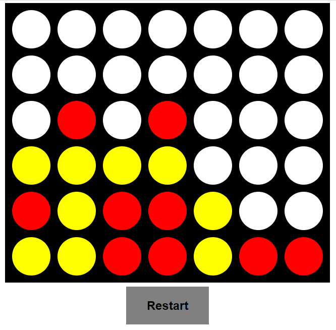

Connect Four Game
===================

This is a Spring Boot + Javascript solution that implements the well-known Connect Four game.

Two different human users can play against the machine, at the same time by accessing /games/1 or /games/2.

The AI is not perfect, since it does not use any AI known algorithm, but a simpler one, made to try to avoid human user to win by putting pieces around human pieces.

## Implementation

* The code uses Java 8 in the most part (it means in the backend part), and simple javascript + html + css at the frontend part.

* One can choose to use the BotRandomStrategy by setting false to the property "strategy.ai"

* The BotAIStrategy tries to avoid human pieces to be aligned. It looks at all human pieces set on the board, see if any of them are 3-aligned, or 2-aligned, and of those it tries to block them.

* It's not optimal, but it's not random either.

## Where to access

One can access the running app at: https://connect-four-web-deviget.herokuapp.com/games/1 or https://connect-four-web-deviget.herokuapp.com/games/2

## Api Documentation

One can access the Api Documentation by accessing: https://connect-four-web-deviget.herokuapp.com/swagger-ui.html

## Run local

To run local, one may change /public/games/1/app.js and /public/games/2/app.js and set hostName variable to localhost:PORT, where PORT is the port one decided to use local.
The PORT is defined at application.yml in property server.port

